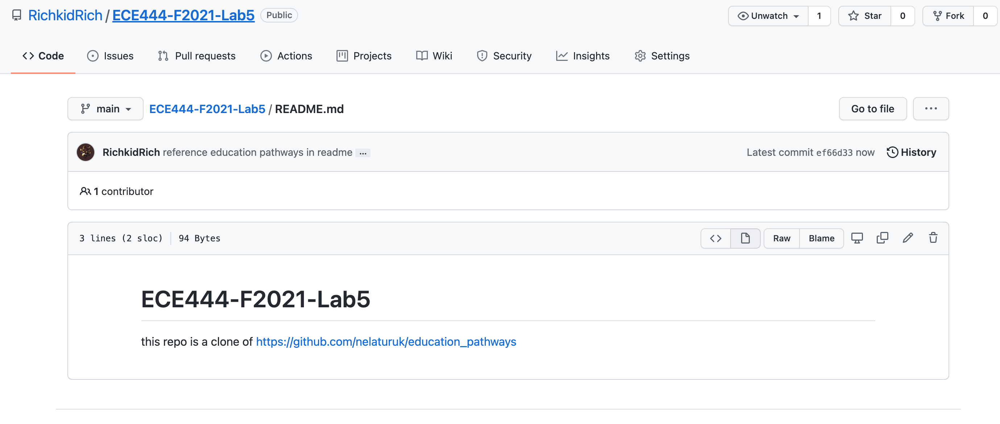
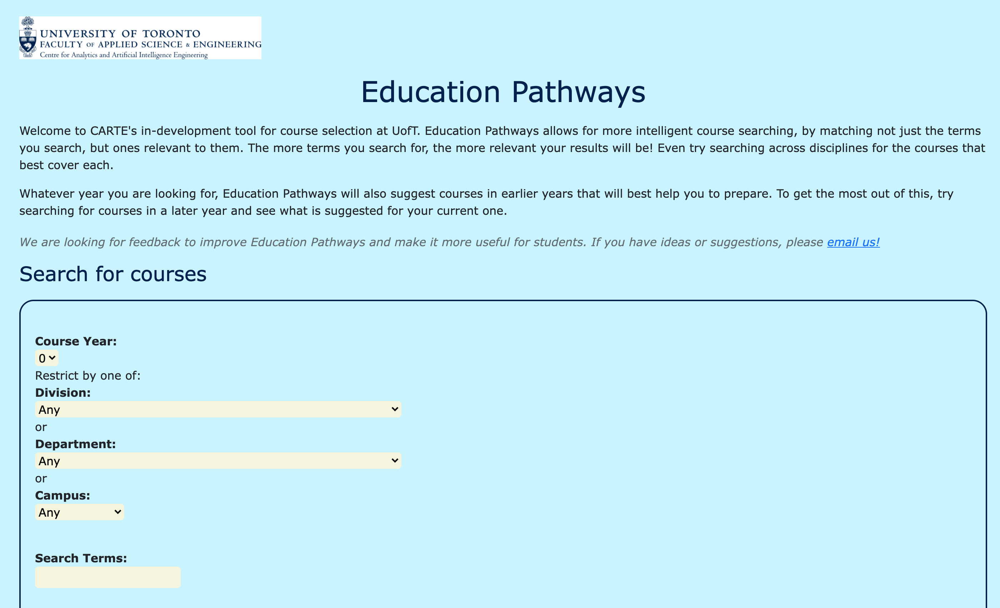
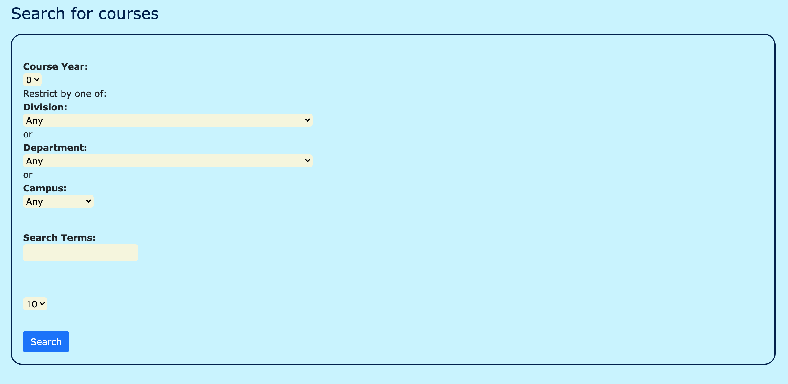
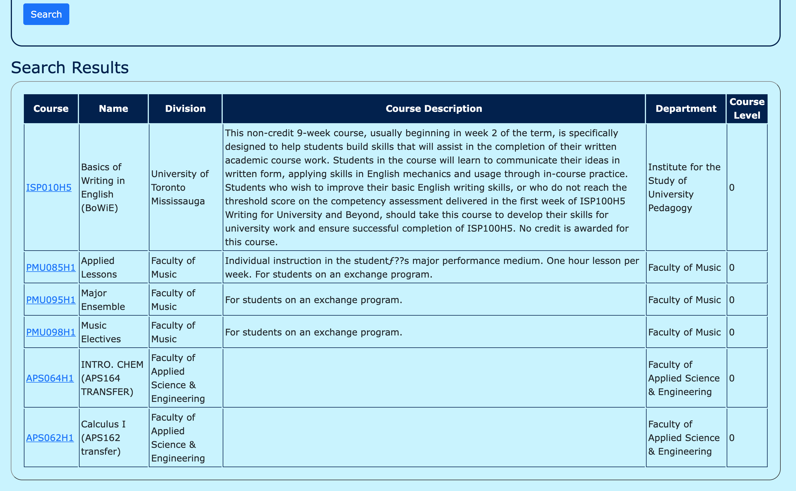

# ECE444-F2021-Lab5
 
this repo is a clone of https://github.com/nelaturuk/education_pathways

## Activity 1

## Activity 2-4

## Activty 6
The new UI clearly lays out and organizes the form field to be in different layers, rather than all bunched up with zero formatting like the old UI. The use of borders in the new UI also helps to clearly divide the home page text, form sections and results much more nicely. Table headers and rows and columns are also much more clearly distinguishable with the introduction of colors and borders.
